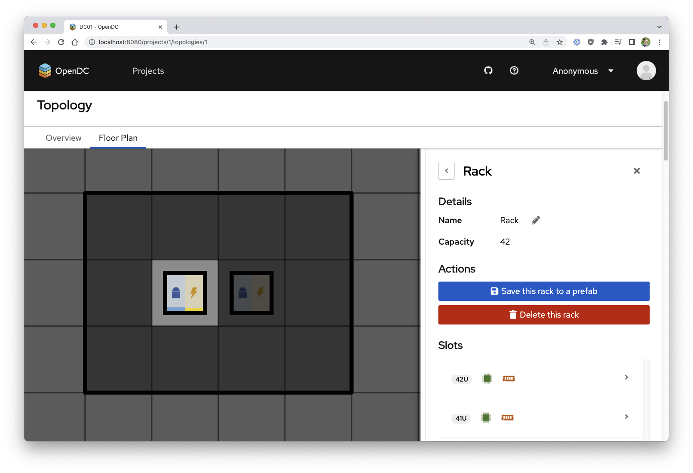

# OpenDC

Collaborative Datacenter Simulation and Exploration for Everybody

-----

OpenDC is a free and open-source platform for datacenter simulation aimed at both research and education.

Users can construct datacenters (see above) and define portfolios of scenarios (experiments) to see how these
datacenters perform under different workloads and schedulers (see below).

)

The simulator is accessible both as a ready-to-use website hosted by us at [app.opendc.org](https://app.opendc.org), and
as source code that users can run locally on their own machine or via Docker.

To learn more
about OpenDC, have a look through our paper [OpenDC 2.0](https://atlarge-research.com/pdfs/ccgrid21-opendc-paper.pdf)
or on our [vision](https://atlarge-research.com/pdfs/opendc-vision17ispdc_cr.pdf).

🛠 OpenDC is a project by the [@Large Research Group](https://atlarge-research.com).

🐟 OpenDC comes bundled
with [Capelin](https://repository.tudelft.nl/islandora/object/uuid:d6d50861-86a3-4dd3-a13f-42d84db7af66?collection=education)
, the capacity planning tool for cloud datacenters based on portfolios of what-if scenarios. More information on how to
use and extend Capelin coming soon!

## Documentation

You can find the OpenDC documentation [on the website](https://opendc.org/).

Check out the [Getting Started](https://opendc.org/docs/getting-started.html) page for a quick overview.

The documentation is divided into several sections:

* [Main Concepts](https://opendc.org/docs/category/getting-started)
* [Tutorials](https://opendc.org/docs/category/tutorials)
* [Advanced Guides](https://opendc.org/docs/category/advanced-guides)
* [Where to Get Support](https://opendc.org/community/support)
* [Contributing Guide](https://opendc.org/community/contributing)

The source code for the documentation is located in [site](site).

## Contributing

Questions, suggestions and contributions are welcome and appreciated!
Please refer to the [contributing guidelines](CONTRIBUTING.md) for more details.

## License

OpenDC is distributed under the MIT license. See [LICENSE.txt](/LICENSE.txt).
