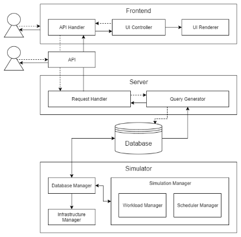

<h1 align="center">
    
    <br>
    OpenDC
</h1>
<p align="center">
    Collaborative Datacenter Simulation and Exploration for Everybody
</p>

<br>

OpenDC is an open-source simulator for datacenters aimed at both research and education.


Users can construct datacenters (see above) and define experiments to see how these datacenters perform under different workloads and schedulers (see below). 


The simulator is accessible both as a ready-to-use website hosted by Delft University of Technology at [opendc.org](https://opendc.org), and as source code that users can run locally on their own machine.

OpenDC is a project by the [@Large Research Group](http://atlarge-research.com).

## Architecture

OpenDC consists of four components: a Kotlin [simulator](/simulator), a MongoDB database, a Python Flask [API](/api), and a React.js [frontend](/frontend), each in their own subdirectories.

<p align="center">
    
</p>

On the frontend, users can construct a topology by specifying a datacenter's rooms, racks and machines, and create experiments to see how a workload trace runs on that topology. The frontend communicates with the web server over SocketIO, through a custom REST request/response layer. For example, the frontend might make a `GET` request to `/api/v1/users/{userId}`, but this request is completed via SocketIO, not plain HTTP requests. Note that the API itself can also be accessed by HTTP.

The (Swagger/OpenAPI compliant) API spec specifies what requests the frontend can make to the web server. To view this specification, go to the [Swagger Editor](https://editor.swagger.io/) and paste in our [opendc-api-spec.yml](opendc-api-spec.yml).

The web server receives API requests and processes them in the database. When the frontend requests to run a new experiment, the web server adds it to the `experiments` table in the database and sets is `state` as `QUEUED`.

The simulator monitors the database for `QUEUED` experiments, and simulates them as they are submitted. It writes the resulting `machine_states` to the database, which the frontend can then again retrieve via the web server.

## Setup

### Preamble

The official way to run OpenDC is using Docker. Other options include building and running locally, and building and running to deploy on a server.

For all of these options, you have to create a Google API Console project and client ID, which the OpenDC frontend and web server will use to authenticate users and requests. Follow [these steps](https://developers.google.com/identity/sign-in/web/sign-in) to make such a project. In the 'Authorized JavaScript origins' and 'Authorized redirect URI' fields, be sure to add `http://localhost:8081` and `https://localhost:3000`. Download the JSON of the OAuth 2.0 client ID you created from the Credentials tab, and specifically note the `client_id`, which you'll need to build OpenDC.

### Installing Docker

GNU/Linux, Mac OS X and Windows 10 Professional users can install Docker by following the instructions [here](https://www.docker.com/products/docker). 

Users of Windows 10 Home and previous editions of Windows can use [Docker Toolbox](https://www.docker.com/products/docker-toolbox). If you're using the toolbox, don't forget to setup port forwarding (see the following subsection if you haven't done that, yet).

#### Port Forwarding

_Skip this if you have GNU/Linux, Mac OS X and Windows 10 Professional._

Open VirtualBox, navigate to the settings of your default docker VM, and go to the 'Network' tab. There, hidden in the 'Advanced' panel, is the 'Port forwarding' feature, where you can set a rule for exposing a port of the VM to the host OS. Add one from guest IP `10.0.2.15` to host IP `127.0.0.1`, both on port `8081`. This enables you to open a browser on your host OS and navigate to `http://localhost:8081`, once the server is running.

### Running OpenDC

To build and run the full OpenDC stack locally on Linux or Mac, you first need to clone the project:

```bash
# Clone the repo and its submodules
git clone https://github.com/atlarge-research/opendc.git

# Enter the directory
cd opendc/
```

In the directory you just entered, you need to set up a set of environment variables. To do this, create a file called `.env` in the `opendc` folder. In this file, replace `your-google-oauth-client-id` with your `client_id` from the OAuth client ID you created and put the path of this `opendc` folder in the place of `/your/path/to/opendc`. For a standard setup, you can leave the other settings as-is.

```.env
MONGO_INITDB_ROOT_USERNAME=root
MONGO_INITDB_ROOT_PASSWORD=rootpassword
MONGO_INITDB_DATABASE=admin
OPENDC_DB=opendc
OPENDC_DB_USERNAME=opendc
OPENDC_DB_PASSWORD=opendcpassword
OPENDC_FLASK_SECRET="This is a secret flask key, please change"
OPENDC_OAUTH_CLIENT_ID=your-google-oauth-client-id
OPENDC_ROOT_DIR=/your/path/to/opendc
OPENDC_SERVER_BASE_URL=http://localhost:8081
```

Afterwards, you should also create a `traces/` directory in which you place the VM and workflow traces you want to
experiment with.

If you plan to publicly deploy, please also tweak the other settings. In that case, also check the `docker-compose.yml` for further instructions.

Now, start the server:

```bash
# Build the Docker image
docker-compose build

# Start the containers
docker-compose up
```

Wait a few seconds and open `http://localhost:8081` in your browser to use OpenDC.
