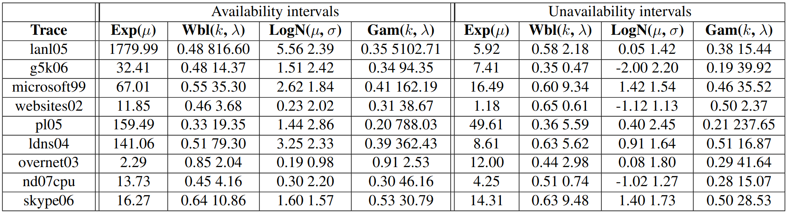

### FailureModel
The failure model that should be used during the simulation
See [FailureModels](FailureModel.md) for detailed instructions.


OpenDC provides three types of failure models: [Trace-based](#trace-based-failure-models), [Sample-based](#sample-based-failure-models),
and [Prefab](#prefab-failure-models).

All failure models have a similar structure containing three simple steps.

1. The _interval_ time determines the time between two failures.
2. The _duration_ time determines how long a single failure takes.
3. The _intensity_ determines how many hosts are effected by a failure.

:::info Code
The code that defines the Failure Models can found [here](https://github.com/atlarge-research/opendc/blob/master/opendc-experiments/opendc-experiments-base/src/main/kotlin/org/opendc/experiments/base/experiment/specs/FailureModelSpec.kt).
:::

## Trace based failure models
Trace-based failure models are defined by a parquet file. This file defines the interval, duration, and intensity of
several failures. The failures defined in the file are looped. A valid failure model file follows the format defined below:

| Metric            | Datatype   | Unit          | Summary                                    |
|-------------------|------------|---------------|--------------------------------------------|
| failure_interval  | int64      | milli seconds | The duration since the last failure        |
| failure_duration  | int64      | milli seconds | The duration of the failure                |
| failure_intensity | float64    | ratio         | The ratio of hosts effected by the failure |

:::info Code
The code implementation of Trace Based Failure Models can be found [here](https://github.com/atlarge-research/opendc/blob/master/opendc-compute/opendc-compute-failure/src/main/kotlin/org/opendc/compute/failure/models/TraceBasedFailureModel.kt)
:::

### Example
A trace-based failure model is specified by setting "type" to "trace-based".
After, the user can define the path to the failure trace using "pathToFile":
```json
{
    "type": "trace-based",
    "pathToFile": "path/to/your/failure_trace.parquet"
}
```

The "repeat" value can be set to false if the user does not want the failures to loop:
```json
{
    "type": "trace-based",
    "pathToFile": "path/to/your/failure_trace.parquet",
    "repeat": "false"
}
```

## Sample based failure models
Sample based failure models sample from three distributions to get the _interval_, _duration_, and _intensity_ of
each failure. Sample-based failure models are effected by randomness and will thus create different results based
on the provided seed.

:::info Code
The code implementation for the Sample based failure models can be found [here](https://github.com/atlarge-research/opendc/blob/master/opendc-compute/opendc-compute-failure/src/main/kotlin/org/opendc/compute/failure/models/SampleBasedFailureModel.kt)
:::

### Distributions
OpenDC supports eight different distributions based on java's [RealDistributions](https://commons.apache.org/proper/commons-math/javadocs/api-3.6.1/org/apache/commons/math3/distribution/RealDistribution.html).
Because the different distributions require different variables, they have to be specified with a specific "type".
Next, we show an example of a correct specification of all available distributions in OpenDC.

#### [ConstantRealDistribution](https://commons.apache.org/proper/commons-math/javadocs/api-3.6.1/org/apache/commons/math3/distribution/ConstantRealDistribution.html)

```json
{
    "type": "constant",
    "value": 10.0
}
```

#### [ExponentialDistribution](https://commons.apache.org/proper/commons-math/javadocs/api-3.6.1/org/apache/commons/math3/distribution/ExponentialDistribution.html)
```json
{
    "type": "exponential",
    "mean": 1.5
}
```

#### [GammaDistribution](https://commons.apache.org/proper/commons-math/javadocs/api-3.6.1/org/apache/commons/math3/distribution/GammaDistribution.html)
```json
{
    "type": "gamma",
    "shape": 1.0,
    "scale": 0.5
}
```

#### [LogNormalDistribution](https://commons.apache.org/proper/commons-math/javadocs/api-3.6.1/org/apache/commons/math3/distribution/LogNormalDistribution.html)
```json
{
    "type": "log-normal",
    "scale": 1.0,
    "shape": 0.5
}
```

#### [NormalDistribution](https://commons.apache.org/proper/commons-math/javadocs/api-3.6.1/org/apache/commons/math3/distribution/NormalDistribution.html)
```json
{
    "type": "normal",
    "mean": 1.0,
    "std": 0.5
}
```

#### [ParetoDistribution](https://commons.apache.org/proper/commons-math/javadocs/api-3.6.1/org/apache/commons/math3/distribution/ParetoDistribution.html)
```json
{
    "type": "pareto",
    "scale": 1.0,
    "shape": 0.6
}
```

#### [UniformRealDistribution](https://commons.apache.org/proper/commons-math/javadocs/api-3.6.1/org/apache/commons/math3/distribution/UniformRealDistribution.html)
```json
{
    "type": "constant",
    "lower": 5.0,
    "upper": 10.0
}
```

#### [WeibullDistribution](https://commons.apache.org/proper/commons-math/javadocs/api-3.6.1/org/apache/commons/math3/distribution/WeibullDistribution.html)
```json
{
    "type": "constant",
    "alpha": 0.5,
    "beta": 1.2
}
```

### Example
A sample-based failure model is defined using three distributions for _intensity_, _duration_, and _intensity_.
Distributions can be mixed however the user wants. Note, values for _intensity_ and _duration_ are clamped to be positive.
The _intensity_ is clamped to the range [0.0, 1.0).
To specify a sample-based failure model, the type needs to be set to "custom".

Example:
```json
{
    "type": "custom",
    "iatSampler": {
        "type": "exponential",
        "mean": 1.5
    },
    "durationSampler": {
        "type": "constant",
        "alpha": 0.5,
        "beta": 1.2
    },
    "nohSampler": {
        "type": "constant",
        "value": 0.5
    }
}
```

## Prefab failure models
The final type of failure models is the prefab models. These are models that are predefined in OpenDC and are based on
research. Currently, OpenDC has 9 prefab models based on [The Failure Trace Archive: Enabling the comparison of failure measurements and models of distributed systems](https://www-sciencedirect-com.vu-nl.idm.oclc.org/science/article/pii/S0743731513000634)
The figure below shows the values used to define the failure models.


Each failure model is defined four times, on for each of the four distribution.
The final list of available prefabs is thus:

    G5k06Exp
    G5k06Wbl
    G5k06LogN
    G5k06Gam
    Lanl05Exp
    Lanl05Wbl
    Lanl05LogN
    Lanl05Gam
    Ldns04Exp
    Ldns04Wbl
    Ldns04LogN
    Ldns04Gam
    Microsoft99Exp
    Microsoft99Wbl
    Microsoft99LogN
    Microsoft99Gam
    Nd07cpuExp
    Nd07cpuWbl
    Nd07cpuLogN
    Nd07cpuGam
    Overnet03Exp
    Overnet03Wbl
    Overnet03LogN
    Overnet03Gam
    Pl05Exp
    Pl05Wbl
    Pl05LogN
    Pl05Gam
    Skype06Exp
    Skype06Wbl
    Skype06LogN
    Skype06Gam
    Websites02Exp
    Websites02Wbl
    Websites02LogN
    Websites02Gam

:::info Code
The different Prefab models can be found [here](https://github.com/atlarge-research/opendc/tree/master/opendc-compute/opendc-compute-failure/src/main/kotlin/org/opendc/compute/failure/prefab)
:::

### Example
To specify a prefab model, the "type" needs to be set to "prefab".
After, the prefab can be defined with "prefabName":

```json
{
    "type": "prefab",
    "prefabName": "G5k06Exp"
}
```

