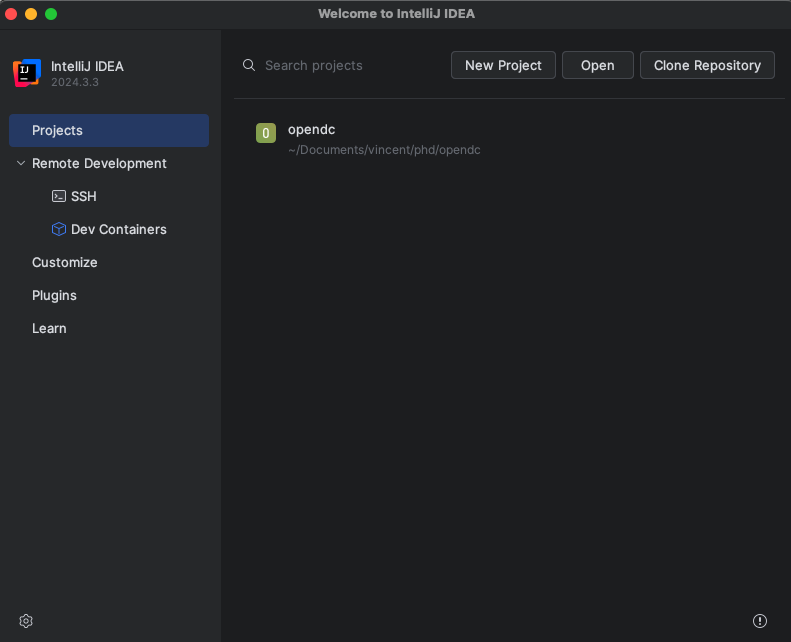
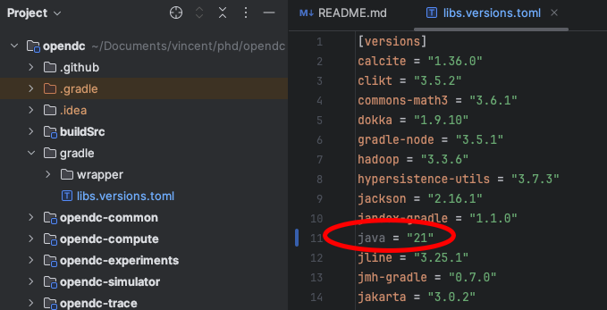
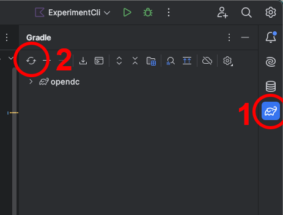
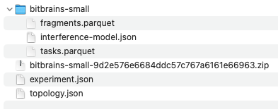
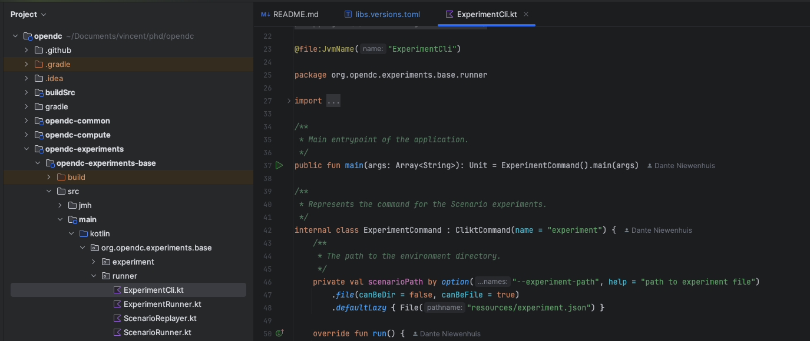
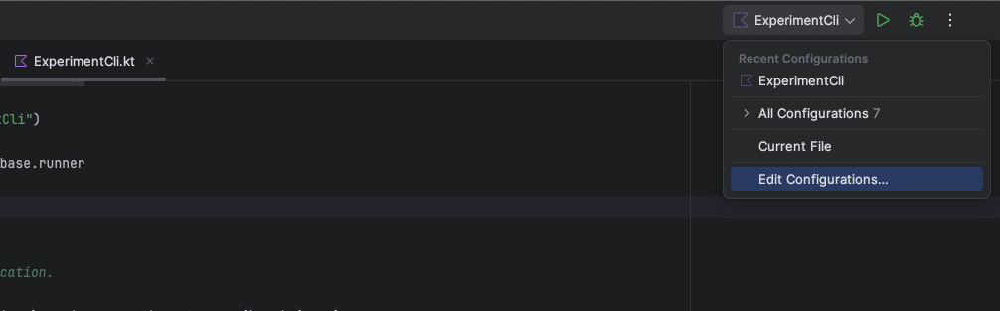
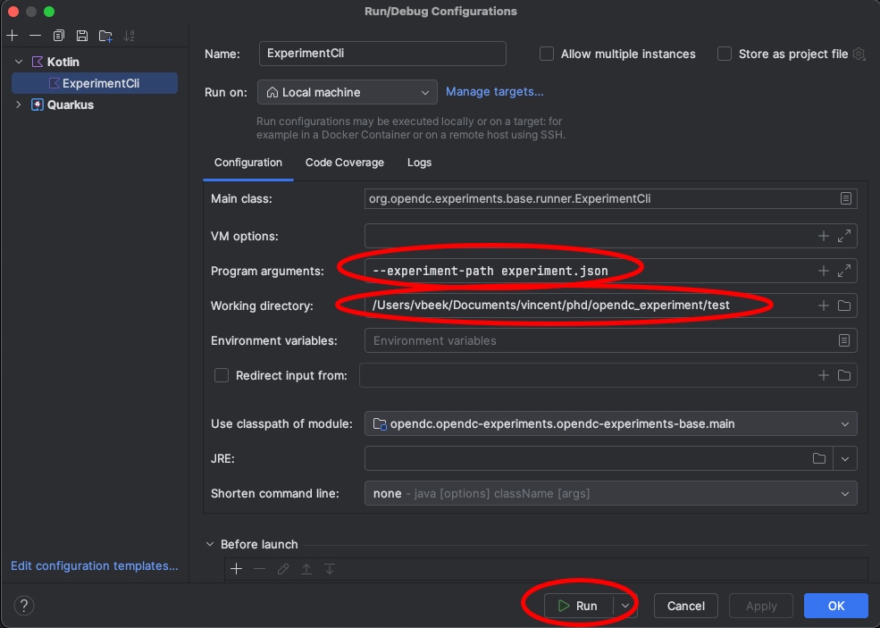

# In this How-To we explain how you setup IntelliJ IDEA

First of all you can download IntelliJ here: https://lp.jetbrains.com/intellij-idea-promo/

# Basic steps

```
git clone git@github.com:atlarge-research/opendc
```

Check if you have a compatible java version available. Make sure to have one of these versions available: [21]

If not install a supported version!

On a MAC

```
/usr/libexec/java_home -V
```

On Debian

```
update-alternatives --list java
```

On Redhat/Centos

```
yum list installed | grep java
```


Open the project in IntelliJ



Now fix the settings so that you use the correct java version. (In the example the java version is set to "21")
Navigation path in the settings pannel: "Build, Execution, Deployment" -> "Build Tools" -> "Gradle"


Now navigate in the file menu to and open the file: "gradle"/"libs.versions.toml"

Make sure the java version is set to the same version as previously cofigured in the settings.




Now open the Gradle panel on the right-hand side of the editor (1) and hit the refresh button at the top of the panel (2).




# Setup your first experiment and run it from source


Create a directory where you are going to put the files for your first experiment.

File structure:



You can download the example workload trace (bitbrains-small-9d2e576e6684ddc57c767a6161e66963.zip) [here](https://atlarge-research.github.io/opendc/assets/files/bitbrains-small-9d2e576e6684ddc57c767a6161e66963.zip)

Now unzip the trace.

The content of "topology.json"

```
{
    "clusters":
    [
        {
            "name": "C01",
            "hosts" :
            [
                {
                    "name": "H01",
                    "cpu":
                    {
                        "coreCount": 32,
                        "coreSpeed": 3200
                    },
                    "memory": {
                        "memorySize": 256000
                    }
                }
            ]
        },
        {
            "name": "C02",
            "hosts" :
            [
                {
                    "name": "H02",
                    "count": 6,
                    "cpu":
                    {
                        "coreCount": 8,
                        "coreSpeed": 2930
                    },
                    "memory": {
                        "memorySize": 64000
                    }
                }
            ]
        },
        {
            "name": "C03",
            "hosts" :
            [
                {
                    "name": "H03",
                    "count": 2,
                    "cpu":
                    {
                        "coreCount": 16,
                        "coreSpeed": 3200
                    },
                    "memory": {
                        "memorySize": 128000
                    }
                }
            ]
        }
    ]
}
```

The content of "experiment.json"

The paths in the "experiment.json" file are relative to the "working directory" which is configured next.


```
{
    "name": "simple",
    "topologies": [{
        "pathToFile": "topology.json"
	}],
    "workloads": [{
        "pathToFile": "bitbrains-small",
        "type": "ComputeWorkload"
    }]
}
```

In the project file structure on the left open the following file:

"opendc-experiments"/"opendc-experiments-base"/"src"/"main"/"kotlin"/"org.opendc.experiment.base"/"runner"/"ExperimentCLi.kt"



Now open the "Run/Debug" configuration (top right).



We need to edit two settings:

"Program arguments": --experiment-path experiment.json

"Working Directory": a path where you have put the experiment files



Now you can click "Run" and start your first experiment.

In the working directory a "output" direcotry is created with the results of the experiment.

