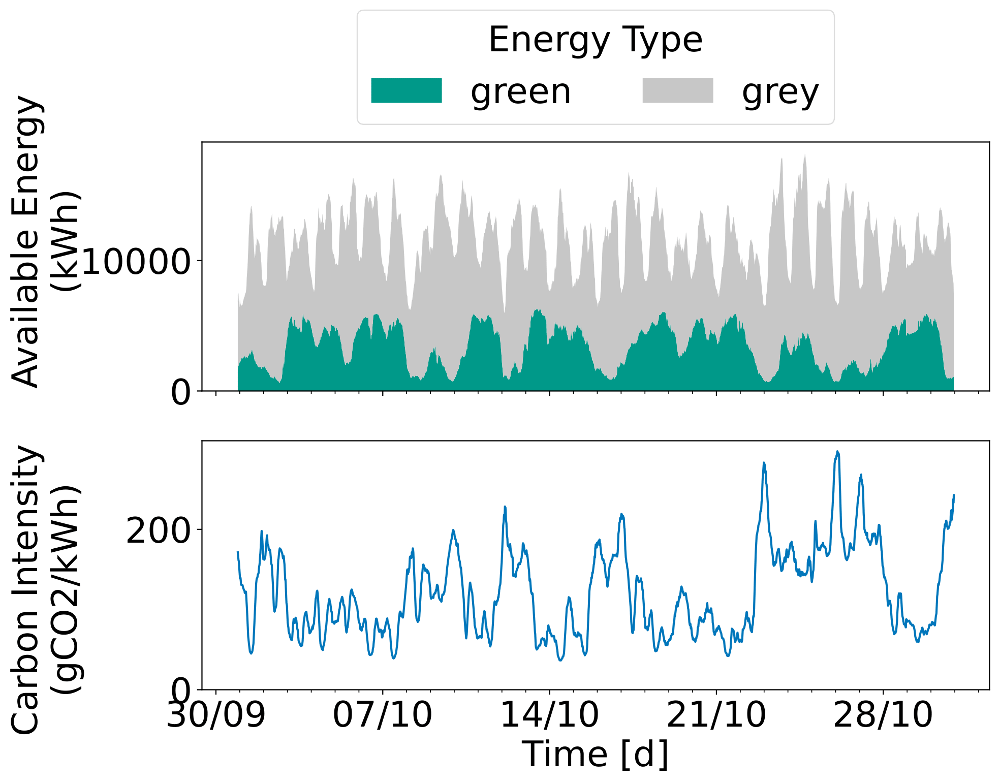

# Running the Experiment
In this demo, we are going to investigate the effect of the location of a datacenter on its carbon footprint. 
The same data center is placed in four different locations; Belgium, Germany, Netherlands, and France. 
Because they are getting their energy from different sources, their carbon emission is different. This demo is based on the work done for the workshop paper `FootPrinter: Quantifying Data Center Carbon Footprint` which can found [here](https://atlarge-research.com/pdfs/2024-hotcloud-footprinter.pdf).

:::info
In this tutorial, we will learn how to create and execute a simple experiment in OpenDC.

This is tutorial is based on a "Carbon emission demo" which can be found on the OpenDC [github](https://github.com/atlarge-research/opendc).

Download the demo [here] to run in an interactive notebook.
:::


Running this demo requires OpenDC. Download the latest release [here](https://github.com/atlarge-research/opendc/releases) and put it in this folder.

## 1. Carbon Footprint

With the rise of high-computational workloads, such as Artificial Intelligence, datacenters are using a lot of energy. Because of this datacenters have become increasingly large contributors to the global footprint. A common definition of the carbon footprint of a datacenter is its total carbon emissions. In this demo, we are looking at the operational carbon emission of a datacenter. Operational carbon is all carbon that is emitted when producing the energy required to run a workload. 

### Carbon Intensity
Determining the operational carbon emission of a datacenter requires more than just the energy used. Equally important is the source of the energy. Using energy from non-green sources, such as coal, can emit up to 20x times as much carbon as green energy, such as solar. Carbon Intensity defines the amount of carbon emitted per unit of energy. Multiplying the energy usage of the energy by the carbon intensity of the energy source determines the carbon emission.   

Green energy is primarily gained from natural phenomena, such as wind or sunlight. This results in a continuously changing mix of available energy. This means the carbon intensity, even at the same location, is rarely stable over a long period of time. Below, we see the carbon intensity of the Dutch energy grid during a period of a week:


Figure taken from  [FootPrinter](https://atlarge-research.com/pdfs/2024-hotcloud-footprinter.pdf")

Due to the fluctuating availability of green energy (the Netherlands relies on solar and wind) there is a large variation in carbon intensity over time. This shows that to reduce the carbon emissions it is not just important to reduce energy usage, but also when and where tasks are executed.

## 2. Carbon Traces

OpenDC can determine the carbon emission of a datacenter when provided a carbon trace. 
Carbon traces define the carbon intensity of the energy in a specific region during a particular time period.  
Historical carbon traces can be collected from services such as [entsoe-e](https://www.entsoe.eu/) or [electricitymaps](https://www.electricitymaps.com/). 

Carbon traces are saved as parquet files. Lets see how they look.

<div className="code-cell">

###### Input
```python
import pandas as pd

df_carbon = pd.read_parquet("carbon_traces/BE_2021-2024.parquet")
```
---
###### Output
</div>

<div className="code-cell">

###### Input
```python
df_carbon.head()
```
---
###### Output
|    | timestamp           |   carbon_intensity |
|---:|:--------------------|-------------------:|
|  0 | 2021-01-01 00:00:00 |             254.44 |
|  1 | 2021-01-01 01:00:00 |             247.21 |
|  2 | 2021-01-01 02:00:00 |             219.78 |
|  3 | 2021-01-01 03:00:00 |             191.87 |
|  4 | 2021-01-01 04:00:00 |             211.01 |

</div>

A carbon trace contains a large number of samples containing a timestamp and carbon intensity. During simulation, OpenDC matches the simulation time with the closest sample time. 

**Note**: OpenDC will always try to match to a sample. If the simulation exceeds the range of the carbon trace, it will select the first or last sample. 

## 3. Defining Topologies

Carbon traces are activated by the user in the `topology` file in the `powerSource` variable.
The following is a topology that is connected to the Belgium energy grid: 

```json
{
    "clusters": [
        {
            "name": "C01",
            "hosts": [
                {
                    "name": "H01",
                    "cpu": {
                        "coreCount": 16,
                        "coreSpeed": 2100
                    },
                    "memory": {
                        "memorySize": 100000
                    },
                    "powerModel": {
                        "modelType": "sqrt",
                        "power": 400.0,
                        "idlePower": 32.0,
                        "maxPower": 180.0
                    },
                    "count": 277
                }
            ],
            "powerSource": {
                "carbonTracePath": "carbon_traces/BE_2021-2024.parquet"
            }
        }
    ]
}
```

First we see that the datacenter has 277 nodes containing a 16 core CPU. 
Next, we see that the `carbonTracePath` of the `powerSource` is pointed to the Belgium carbon trace.  

Similarly, we can create topologies for the three other contries. See the topologies of [Germany](topologies/surfsara_DE.json), [France](topologies/surfsara_FR.json), and [Netherlands](topologies/surfsara_NL.json)

## 4. Executing the experiment

In this tutorial we want to investigate the impact of the location of a data center on its carbon footprint.
We have defined four `topologies` that are connected to different `carbon traces`. We want to run the same workload using the different `topologies`. This can be done using the following `experiment` file:

```json
{
    "name": "carbon",
    "topologies": [
        {
            "pathToFile": "topologies/surfsara_BE.json"
        },
        {
            "pathToFile": "topologies/surfsara_DE.json"
        },        
        {
            "pathToFile": "topologies/surfsara_FR.json"
        },        
        {
            "pathToFile": "topologies/surfsara_NL.json"
        }
    ],
    "workloads": [
        {
            "pathToFile": "workload_traces/surf_month",
            "type": "ComputeWorkload"
        }
    ],
    "exportModels": [
        {
            "exportInterval": 3600,
            "printFrequency": 168,
            "filesToExport": [
                "host",
                "powerSource",
                "service",
                "task"
            ]
        }
    ]
}
```

Running this `experiment`, will run four simulations, one for each topologies. All four simulations will run a month long workload trace based on the surf LISA computer. 


The experiment can be executed directly from the terminal. While running the experiment, OpenDC periodically prints information about the status of the simulation. In this experiment, OpenDC prints every week, but this can be changes using the `exportModel`.

<div className="code-cell">

###### Input
```python
import subprocess

pathToScenario = "experiments/carbon_experiment.json"
subprocess.run(["OpenDCExperimentRunner/bin/OpenDCExperimentRunner", "--experiment-path", pathToScenario])
```
---
###### Output
<div className="stream-output">


================================================================================
 Running scenario: 0 
================================================================================
 Starting seed: 0 

Simulating...   0% [                                       ] 0/4 (0:00:00 / ?) 
12:18:37.303 [WARN ] org.opendc.compute.simulator.telemetry.ComputeMetricReader - 
					Metrics after 168 hours:
						Tasks Total: 21607
						Tasks Active: 124
						Tasks Pending: 0
						Tasks Completed: 21483
						Tasks Terminated: 0

12:18:38.659 [WARN ] org.opendc.compute.simulator.telemetry.ComputeMetricReader - 
					Metrics after 336 hours:
						Tasks Total: 30276
						Tasks Active: 114
						Tasks Pending: 0
						Tasks Completed: 30162
						Tasks Terminated: 0

12:18:40.212 [WARN ] org.opendc.compute.simulator.telemetry.ComputeMetricReader - 
					Metrics after 504 hours:
						Tasks Total: 58339
						Tasks Active: 145
						Tasks Pending: 0
						Tasks Completed: 58194
						Tasks Terminated: 0

12:18:41.502 [WARN ] org.opendc.compute.simulator.telemetry.ComputeMetricReader - 
					Metrics after 672 hours:
						Tasks Total: 66103
						Tasks Active: 228
						Tasks Pending: 0
						Tasks Completed: 65875
						Tasks Terminated: 0


================================================================================
 Running scenario: 1 
================================================================================
 Starting seed: 0 

Simulating...  25% [========                         ] 1/4 (0:00:10 / 0:00:30) 
12:18:45.457 [WARN ] org.opendc.compute.simulator.telemetry.ComputeMetricReader - 
					Metrics after 168 hours:
						Tasks Total: 21607
						Tasks Active: 124
						Tasks Pending: 0
						Tasks Completed: 21483
						Tasks Terminated: 0

12:18:46.375 [WARN ] org.opendc.compute.simulator.telemetry.ComputeMetricReader - 
					Metrics after 336 hours:
						Tasks Total: 30276
						Tasks Active: 114
						Tasks Pending: 0
						Tasks Completed: 30162
						Tasks Terminated: 0

12:18:47.487 [WARN ] org.opendc.compute.simulator.telemetry.ComputeMetricReader - 
					Metrics after 504 hours:
						Tasks Total: 58339
						Tasks Active: 145
						Tasks Pending: 0
						Tasks Completed: 58194
						Tasks Terminated: 0

12:18:48.382 [WARN ] org.opendc.compute.simulator.telemetry.ComputeMetricReader - 
					Metrics after 672 hours:
						Tasks Total: 66103
						Tasks Active: 228
						Tasks Pending: 0
						Tasks Completed: 65875
						Tasks Terminated: 0


================================================================================
 Running scenario: 2 
================================================================================
 Starting seed: 0 

Simulating...  50% [================                 ] 2/4 (0:00:17 / 0:00:17) 
12:18:51.612 [WARN ] org.opendc.compute.simulator.telemetry.ComputeMetricReader - 
					Metrics after 168 hours:
						Tasks Total: 21607
						Tasks Active: 124
						Tasks Pending: 0
						Tasks Completed: 21483
						Tasks Terminated: 0

12:18:52.377 [WARN ] org.opendc.compute.simulator.telemetry.ComputeMetricReader - 
					Metrics after 336 hours:
						Tasks Total: 30276
						Tasks Active: 114
						Tasks Pending: 0
						Tasks Completed: 30162
						Tasks Terminated: 0

12:18:53.505 [WARN ] org.opendc.compute.simulator.telemetry.ComputeMetricReader - 
					Metrics after 504 hours:
						Tasks Total: 58339
						Tasks Active: 145
						Tasks Pending: 0
						Tasks Completed: 58194
						Tasks Terminated: 0

12:18:54.466 [WARN ] org.opendc.compute.simulator.telemetry.ComputeMetricReader - 
					Metrics after 672 hours:
						Tasks Total: 66103
						Tasks Active: 228
						Tasks Pending: 0
						Tasks Completed: 65875
						Tasks Terminated: 0


================================================================================
 Running scenario: 3 
================================================================================
 Starting seed: 0 

Simulating...  75% [========================         ] 3/4 (0:00:23 / 0:00:07) 
12:18:57.573 [WARN ] org.opendc.compute.simulator.telemetry.ComputeMetricReader - 
					Metrics after 168 hours:
						Tasks Total: 21607
						Tasks Active: 124
						Tasks Pending: 0
						Tasks Completed: 21483
						Tasks Terminated: 0

12:18:58.432 [WARN ] org.opendc.compute.simulator.telemetry.ComputeMetricReader - 
					Metrics after 336 hours:
						Tasks Total: 30276
						Tasks Active: 114
						Tasks Pending: 0
						Tasks Completed: 30162
						Tasks Terminated: 0

12:18:59.582 [WARN ] org.opendc.compute.simulator.telemetry.ComputeMetricReader - 
					Metrics after 504 hours:
						Tasks Total: 58339
						Tasks Active: 145
						Tasks Pending: 0
						Tasks Completed: 58194
						Tasks Terminated: 0

12:19:00.543 [WARN ] org.opendc.compute.simulator.telemetry.ComputeMetricReader - 
					Metrics after 672 hours:
						Tasks Total: 66103
						Tasks Active: 228
						Tasks Pending: 0
						Tasks Completed: 65875
						Tasks Terminated: 0


Simulating... 100% [=================================] 4/4 (0:00:28 / 0:00:00) 

</div>

```
CompletedProcess(args=['OpenDCExperimentRunner/bin/OpenDCExperimentRunner', '--experiment-path', 'experiments/carbon_experiment.json'], returncode=0)
```
</div>

Running the simulation has created the `output` folder containing information about the experiment. 
In the next part we will use these files for analysis and vizualization.
